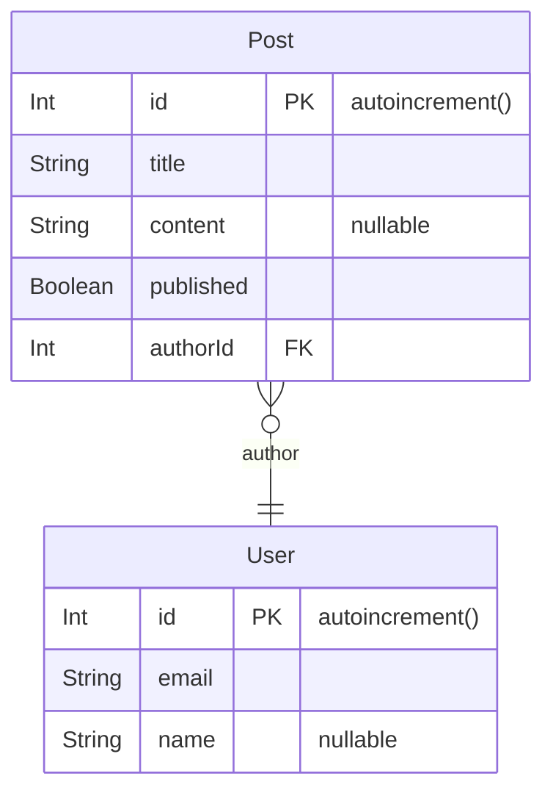

# Prisma ERD Generator Markdown

Prisma generator to create a mermaid ERD in a markdown file.

## Install

```bash
npm i -D prisma-erd-generator-markdown
# or
yarn add -D prisma-erd-generator-markdown
```

## Setup

Add to your `schema.prisma`

```prisma
generator erd {
  provider = "prisma-erd-generator-markdown"
  output   = "./ERD.md"
}
```

## Generate

Run the generator

```bash
npx prisma generate
```

## Example

Given the following prisma schema:

```prisma
model User {
  id    Int     @id @default(autoincrement())
  email String  @unique
  name  String?
  posts Post[]
}


model Post {
  id        Int     @id @default(autoincrement())
  title     String
  content   String?
  published Boolean @default(false)
  author    User    @relation(fields: [authorId], references: [id])
  authorId  Int
}
```

This diagram will be generated:



> This generator was bootstraped using [create-prisma-generator](https://github.com/YassinEldeeb/create-prisma-generator)
