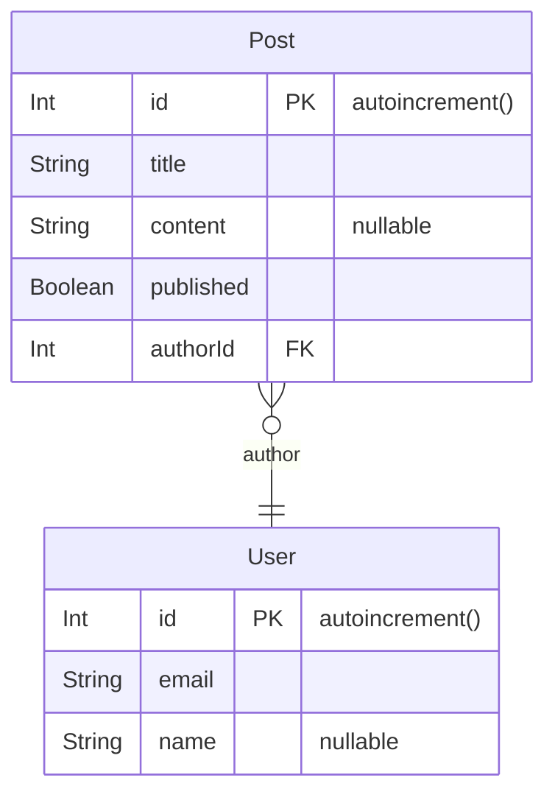

```mermaid
erDiagram
	User {
		Int id PK  "autoincrement()"
		String email
		String name  "nullable"
	}
	Post {
		Int id PK  "autoincrement()"
		String title
		String content  "nullable"
		Boolean published
		Int authorId FK
	}
	Post }o--|| User : author

```
